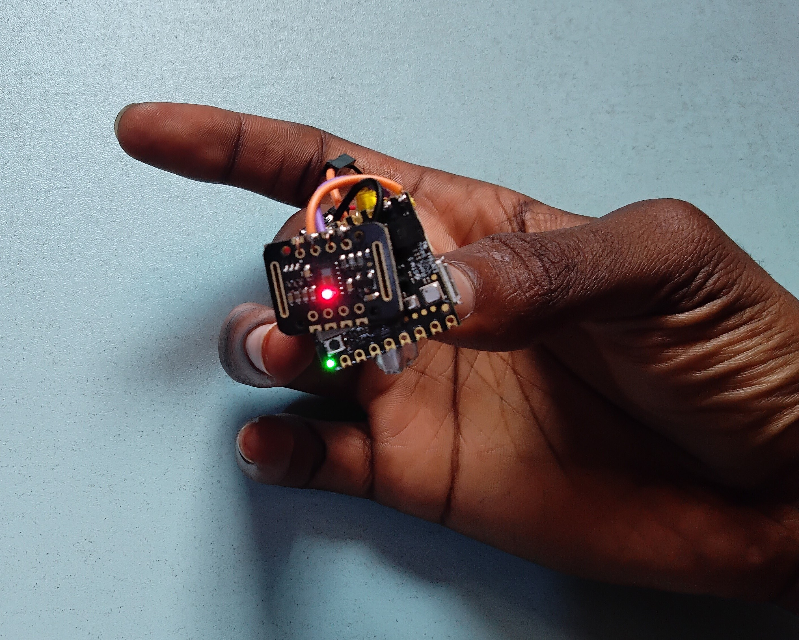

<!--
  * Create links to hardware and software
  * Add about me section

-->

# Arduino BLE Heart Rate Monitor
  
  
  This project demonstrates how to use the MAX30102 pulse oximeter and an Arduino board to measure a user's heart rate. The system measures heart rate using photoplethysmography (PPG) and transmits the data via Bluetooth Low Energy (BLE) to a central device, such as a smartphone or tablet.

  The project consists of an Arduino sketch that reads the sensor data and communicates with the BLE module, as well as a wiring diagram that shows how to connect the MAX30102 sensor to the Arduino board.

  The system is powered by a battery, making it portable and easy to use.

  
  It is also possible to measure blood oxygen saturation (SpO2) level alongside heart rate with the same hardware.

## Technical Specifications
### Hardware
  * [Arduino Nicla Sense ME](https://store.arduino.cc/products/nicla-sense-me)
  * MAX30102 pulse oximeter and heart rate sensor
  * 3.7V LiPo battery
  * Jumper wires
  
### Software
  * [Arduino IDE](https://www.arduino.cc/en/software)
  * [LightBlue for Android](https://play.google.com/store/apps/details?id=com.punchthrough.lightblueexplorer&hl=en&gl=US) or [LightBlue for IoS](https://apps.apple.com/us/app/lightblue/id557428110)

### Board Managers
  * Arduino Mbed OS Nicla Boards (by Arduino)

### Libraries
<!-- replace with links -->
  * Wire (by Arduino)
  * ArduinoBLE (by Arduino)
  * SparkFun MAX3010x Pulse and Proximity Sensor Library (by SparkFun Electronics)
  * `Nicla_System.h` (bundled with the Mbed OS Nicla boards manager)
  * `heartRate.h` (bundled with the MAX3010x library)

## Getting Started
### Wiring
Connect the MAX30102 sensor to the Arduino Nicla Sense ME as follows:
  * SDA pin to SDA/GPIO 4
  * SCL pin to SCL/GPIO 3
  * VCC pin to VDDIO_EXT
  * GND pin to GND

Connect the battery to the Arduino Nicla Sense ME as follows: (after uploading to the board)
  * Red wire to VBAT
  * Black wire to GND
  * Yellow wire to NTC (if provided)

### Installation
  * Clone or download this repository to your computer.
  * Open the ble_heart_rate.ino sketch in the Arduino IDE.
  * Install required board managers
  * Install the required libraries
  * Connect the Arduino board to your computer via USB.
  * Select the board and port in the Arduino IDE (the Nicla Sense ME is automatically detected in the Arduino IDE 2).
  * Upload the sketch to the Arduino board.

NB: * Test the results with the serial monitor before deploying 
    * Comment out serial communication code when deploying for efficient execution

### Usage
  * Disconnect the board from the computer and connect the battery to power it.
<!-- how to config app -->
  * Scan for available BLE devices on in the app and connect to the Arduino board.
  * The heart rate and SpO2 readings will be displayed on the central device in real-time.<!-- steps to view data -->

## Project Overview and Functionality
### Heart Rate Measurement
The system uses the principle of photoplethysmography (PPG) to measure heart rate. PPG involves the detection of changes in the light absorption of blood vessels, which is caused by the pulsatile flow of blood. The MAX30102 pulse oximeter has two LEDs, a red LED and an infrared (IR) LED, which are used to emit light into the blood vessels. The light that is transmitted through the blood vessels is detected by a photodetector, which generates a signal that is processed to measure the heart rate.

### Pulse Oximetry
The system also uses pulse oximetry to measure blood oxygen levels. Pulse oximetry is based on the principle that the amount of RED and IR light absorbed varies depending on the amount of oxygen in your blood. The MAX30102 pulse oximeter measures the amount of light absorbed by the blood vessels and uses this information to calculate blood oxygen levels.

## Demo and Practical Use Videos
  * [Demo Video](https://youtu.be/AVLHx5wZgHM): This video provides an overview of the project and shows how it works.

## References
  * [Interfacing MAX30102 Pulse Oximeter and Heart Rate Sensor with Arduino](https://lastminuteengineers.com/max30102-pulse-oximeter-heart-rate-sensor-arduino-tutorial/)
  * Arduino Nicla Sense ME: 
    * [Datasheet](https://docs.arduino.cc/static/f8271c290327a9ad575803b3ec72d415/ABX00050-datasheet.pdf)
    * [Pinout diagram](https://docs.arduino.cc/static/fbbb024be69af5a2b992df75ad165bc3/ABX00050-pinout.png)
    * [Full pinout diagram]([https://docs.arduino.cc/static/fbbb024be69af5a2b992df75ad165bc3/ABX00050-pinout.png](https://content.arduino.cc/assets/ABX00050-full-pinout.pdf))
    * [Schematics](https://docs.arduino.cc/static/ebd652e859efba8536a7e275c79d5f79/ABX00050-schematics.pdf)
  * [ArduinoBLE reference](https://www.arduino.cc/reference/en/libraries/arduinoble/)
  

 

## Contributions
If you have any suggestions, bug reports, or contributions, please feel free to open an issue or a pull request.
